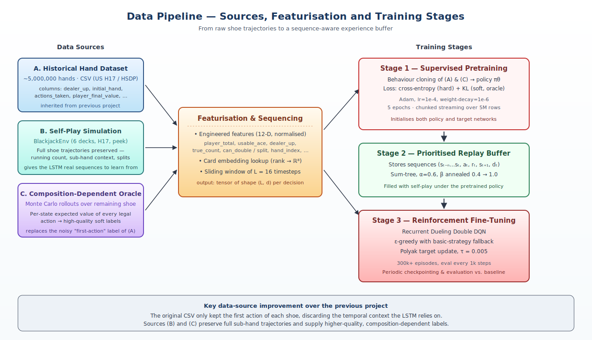
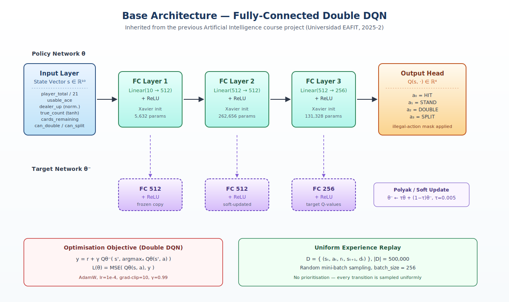
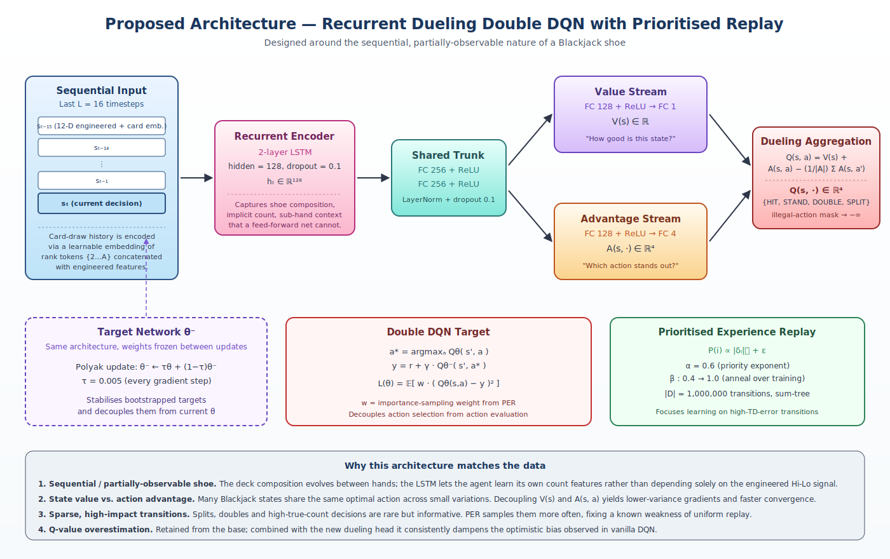
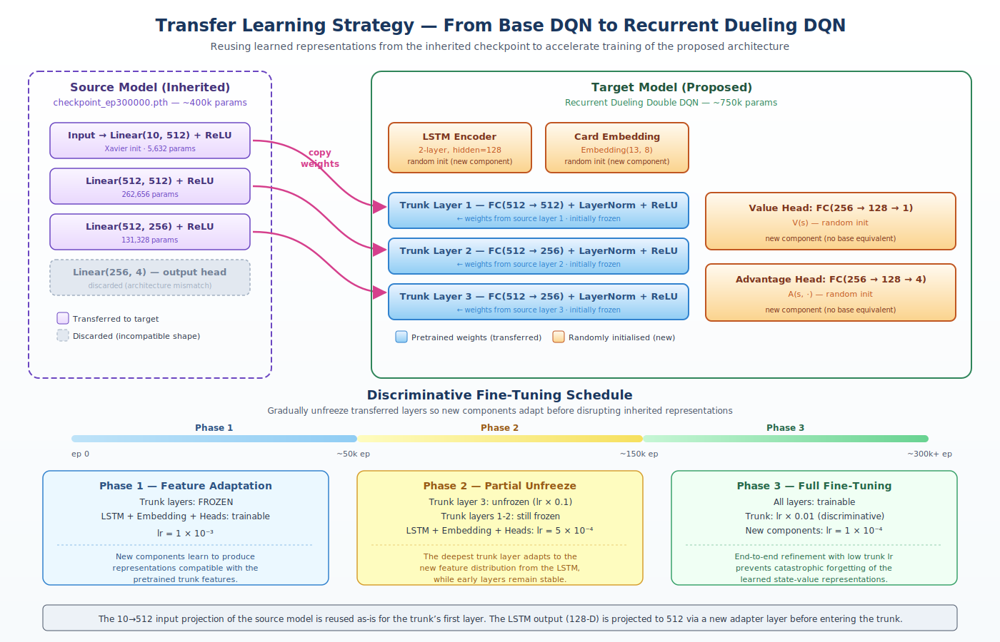

# Lemmy BlackJack Agent

**Universidad EAFIT — Neural Networks and Deep Learning (2026-1)**

**Authors:** Jean Carlo Londoño, Alejandro Garcés Ramírez, Nicolas Ospina Torres 

**Repository purpose:** project proposal — first deliverable

> A continuation and architectural redesign of the Blackjack reinforcement-learning
> agent originally developed for the Artificial Intelligence course (2025-2,
> [Reinforcement-Learning-Model-to-Play-BlackJack-Lemmy](https://github.com/agr-23/Reinforcement-Learning-Model-to-Play-BlackJack-Lemmy)).
> This iteration aligns the model architecture with the **sequential and partially
> observable** nature of a Blackjack shoe and improves the supervision data that
> feeds it.

---

## Table of Contents

1. [Problem Statement](#1-problem-statement)
2. [Data](#2-data)
3. [Base Architecture](#3-base-architecture)
4. [Proposed Architecture](#4-proposed-architecture)
5. [Data-Source Improvement](#5-data-source-improvement)
6. [Transfer Learning Strategy](#6-transfer-learning-strategy)
7. [Roadmap](#7-roadmap)
8. [References](#8-references)

---

## 1. Problem Statement

### 1.1. Domain

Blackjack is a stochastic, partially observable card game played against a dealer
under fixed rules. The version used here mirrors a U.S. casino:

| Rule              | Setting                                            |
| ----------------- | -------------------------------------------------- |
| Decks per shoe    | 6                                                  |
| Dealer on soft 17 | hits (H17)                                         |
| Peek for BJ       | enabled                                            |
| Surrender         | not allowed                                        |
| Splits            | up to 4 hands; DAS allowed; resplit aces forbidden |
| Split aces        | one card only, forced stand                        |
| Blackjack payout  | 3 : 2                                              |

### 1.2. Decision-making formulation

We model each round as a finite-horizon Markov Decision Process

$$\mathcal{M} = \langle\, \mathcal{S},\ \mathcal{A},\ P,\ R,\ \gamma\, \rangle$$

with

- **State** $s_t \in \mathcal{S}$ — the observable game configuration at decision
  step $t$ (player total, dealer up-card, count features, sub-hand context).
- **Action** $a_t \in \mathcal{A} = \{\text{HIT},\ \text{STAND},\ \text{DOUBLE},\ \text{SPLIT}\}$,
  filtered by an availability mask.
- **Transition** $P(s_{t+1}\mid s_t, a_t)$ — induced by drawing from a finite shoe,
  i.e. **non-stationary**: the deck composition evolves between rounds.
- **Reward** $r_t \in \{-2,\, -1,\, 0,\, +1,\, +1.5,\, +2\}$ — only at terminal
  steps (per sub-hand), scaled by 2 if the action was a double, with 3 : 2
  payout on natural blackjacks.
- **Discount** $\gamma = 0.99$.

The agent must learn a policy

$$\pi^\* (s) \;=\; \arg\max_{a \in \mathcal{A}_{\text{legal}}(s)}\ Q^\* (s, a)$$

that maximises expected return per round.

### 1.3. Why this is a deep-learning problem

Three properties make a vanilla tabular approach insufficient:

1. **Sequential dependence between rounds** — the optimal action depends not
   only on the current hand but on which cards have already been drawn from the
   shoe. A pure MDP over single-hand features collapses this temporal signal.
2. **Partial observability** — the dealer's hole card is hidden, and the deck
   composition is only partially summarised by the running/true count.
3. **Combinatorial state space** — including counting features, splits and
   sub-hand context, the discrete state space exceeds what is convenient to
   tabulate. A function approximator generalises across structurally similar
   states.

### 1.4. Evaluation metrics

| Metric           | Definition                                  | Target                                   |
| ---------------- | ------------------------------------------- | ---------------------------------------- |
| Win rate         | wins / total rounds                         | ≥ 43 % (above the inherited 41 %)        |
| Average return   | mean reward per round                       | ≥ +0.05 (inherited best: +0.03)          |
| House edge       | −1 × average return                         | as close to 0 as possible                |
| Sample efficiency | episodes to reach 40 % win rate            | < 100k (inherited needed ~300k)          |
| True-count corr. | Pearson(action-value, true count)           | should grow during training              |

---

## 2. Data

### 2.1. State representation

At every decision step the environment exposes a dictionary that the agent
projects into a 12-dimensional engineered vector (one extra dim for the
current sub-hand size, one for the episode stage):

| Feature           | Range / encoding             | Purpose                                  |
| ----------------- | ---------------------------- | ---------------------------------------- |
| `player_total`    | 4–21, divided by 21          | hand strength                            |
| `usable_ace`      | {0, 1}                       | soft / hard distinction                  |
| `dealer_up`       | 2–11, normalised             | dealer information                       |
| `true_count`      | tanh of Hi-Lo true count     | shoe richness (engineered counting)      |
| `cards_remaining` | divided by 6 × 52            | deck-penetration awareness               |
| `can_double`      | {0, 1}                       | legal-action mask                        |
| `can_split`       | {0, 1}                       | legal-action mask                        |
| `hand_index`      | divided by 4                 | which sub-hand is being played           |
| `num_hands`       | divided by 4                 | how many sub-hands exist this round      |
| `episode_stage`   | divided by 3                 | early / mid / late shoe                  |
| `hand_size`       | divided by 11                | hit history of current hand              |
| `last_card`       | rank embedding lookup        | most recently drawn card                 |

### 2.2. Action space and masking

```text
0 = HIT      1 = STAND      2 = DOUBLE      3 = SPLIT
```

Illegal actions (e.g. `DOUBLE` with three cards already, `SPLIT` on a non-pair)
are masked to $-\infty$ in the Q-output before $\arg\max$.

### 2.3. Reward shape

Rewards are sparse: $r_t = 0$ at every non-terminal step and an outcome value
at the end of each sub-hand. No reward shaping is added — we want the agent to
discover counting value from the data, not from a hand-crafted bonus.

### 2.4. Available data sources

| Source                                  | Volume                | Granularity                   | Notes                                              |
| --------------------------------------- | --------------------- | ----------------------------- | -------------------------------------------------- |
| **A. Historical CSV (inherited)**       | ~5,000,000 hands      | one row per hand              | only the **first** action is reliably labelled     |
| **B. Self-play simulator**              | unbounded             | full per-decision trajectory  | already implemented in `BlackjackEnv`              |
| **C. Composition-dependent oracle**     | as many as we compute | per-state action values       | Monte Carlo rollouts over the *remaining* shoe     |

A dedicated discussion of how (A) is being augmented by (B) and (C) lives in
[§5](#5-data-source-improvement).

The end-to-end flow is summarised below.



---

## 3. Base Architecture

The base architecture is the one inherited from the Artificial Intelligence
course project. It is a **fully-connected Double DQN** with soft target
updates.



### 3.1. Network

| Component  | Specification                                     |
| ---------- | ------------------------------------------------- |
| Input      | 10-D engineered state vector                      |
| Hidden 1   | `Linear(10 → 512)` + ReLU, Xavier init            |
| Hidden 2   | `Linear(512 → 512)` + ReLU                        |
| Hidden 3   | `Linear(512 → 256)` + ReLU                        |
| Output     | `Linear(256 → 4)` — Q-values, illegal-action mask |

Total trainable parameters: **~400 k**.

### 3.2. Learning loop

- **Algorithm:** Double DQN with soft Polyak target update, $\tau = 0.005$.
- **Loss:** mean-squared TD error.
- **Replay buffer:** uniform, capacity $5 \times 10^5$.
- **Optimiser:** AdamW, learning rate $10^{-4}$, weight-decay $10^{-4}$, gradient
  clipping at norm 10.
- **Exploration:** linearly decayed $\varepsilon$-greedy with a basic-strategy
  fallback during early training.
- **Pretraining:** behaviour cloning on the first action of each row of
  source (A), 1 epoch of streaming over up to 5 M rows.

### 3.3. Inherited results

| Model                          | Win rate | Avg. reward | Episodes |
| ------------------------------ | :------: | :---------: | :------: |
| Q-Learning (tabular)           |  38–41 % |    −0.09    |  200,000 |
| DQN (no heuristic)             |   37 %   |    −0.08    |  300,000 |
| **DQN + Hi-Lo + pretraining**  | **41 %** |  **+0.03**  |  300,000 |

### 3.4. Identified limitations

These are the weaknesses we want the new architecture to address:

1. **No temporal memory.** The network sees only the current state vector;
   information about previous draws is squeezed into a single scalar
   (`true_count`), which is a *hand-crafted* summary.
2. **Single Q-stream.** Vanilla DQN couples state value and action advantage,
   inflating gradient variance in states where all actions yield similar
   returns.
3. **Uniform replay.** Rare-but-pivotal transitions (splits, doubles, very
   high counts) are sampled at the same rate as trivial hits/stands.
4. **First-action labels only.** The pretraining label is the first action of
   each shoe, even when the dataset records the full sequence — a lossy
   supervision signal.

---

## 4. Proposed Architecture

The proposal is a **Recurrent Dueling Double DQN with Prioritised Experience
Replay** — every component is justified by a concrete property of the data.



### 4.1. Components

| Block              | Specification                                                  | Why                                                                     |
| ------------------ | -------------------------------------------------------------- | ----------------------------------------------------------------------- |
| **Card embedding** | `Embedding(13 → 8)` over rank tokens                           | learnable representation of each card, no manual count engineering      |
| **Sequencer**      | sliding window of length $L = 16$                              | gives the model a bounded view of recent draws                          |
| **Encoder**        | 2-layer LSTM, hidden 128, dropout 0.1                          | captures sequential / partially-observable shoe dynamics                |
| **Trunk**          | `FC 256` + LayerNorm + ReLU $\times$ 2                         | shared representation for both heads                                    |
| **Value head**     | `FC 128 → FC 1` → $V(s)$                                       | "how good is this state, regardless of action?"                         |
| **Advantage head** | `FC 128 → FC 4` → $A(s, \cdot)$                                | "which action stands out in this state?"                                |
| **Aggregation**    | $Q(s,a) = V(s) + (A(s,a) - \tfrac{1}{\|\mathcal{A}\|}\sum_{a'} A(s,a'))$ | unbiased dueling combination                                            |
| **Replay**         | Prioritised, sum-tree, $\alpha = 0.6$, $\beta : 0.4 \to 1.0$ | focuses gradient updates on high-TD-error (rare, informative) transitions |
| **Target net**     | identical architecture, Polyak update $\tau = 0.005$           | stabilises bootstrapped targets                                         |

Approximate parameter count: **~750 k** (still small enough to train without a
dedicated GPU, large enough to give the LSTM expressive room).

### 4.2. Optimisation

- **Loss:** importance-sampling-weighted MSE of the Double DQN target,

  $$y = r + \gamma \, Q_{\theta^{-}}\!\left(s', \arg\max_{a} Q_{\theta}(s', a)\right),$$

  $$\mathcal{L}(\theta) = \mathbb{E}_{(s,a,r,s')\sim\mathcal{D}}\left[ w \cdot (Q_\theta(s,a) - y)^2 \right].$$

- **Optimiser:** AdamW, learning rate $1 \times 10^{-4}$, gradient clipping at
  norm 10.
- **Discount:** $\gamma = 0.99$.
- **Exploration:** $\varepsilon$-greedy with $\varepsilon : 1.0 \to 0.05$ over
  $5 \times 10^{5}$ steps; basic-strategy fallback retained for the first
  $\sim 10\,\%$ of training.

### 4.3. Why this architecture matches the data

1. **Sequential / partially-observable shoe.** The LSTM lets the agent learn
   its own count-like features rather than relying solely on the engineered
   Hi-Lo signal.
2. **State-value vs. action-advantage decoupling.** Many Blackjack states share
   the same optimal action across small variations; the dueling decomposition
   reduces gradient variance and accelerates convergence.
3. **Sparse, high-impact transitions.** Splits, doubles and high-true-count
   decisions are rare but informative. PER samples them more often, fixing a
   known weakness of uniform replay.
4. **Q-value overestimation.** Retained from the base; combined with the new
   dueling head it consistently dampens the optimistic bias of vanilla DQN.

### 4.4. Expected gains over the base

| Metric            | Base (inherited) | Proposed (target)   |
| ----------------- | :--------------: | :-----------------: |
| Win rate          | 41 %             | ≥ 43 %              |
| Average return    | +0.03            | ≥ +0.05             |
| Episodes to 40 %  | ~300 k           | < 100 k             |
| Training stability| moderate         | high (PER + dueling)|

---

## 5. Data-Source Improvement

The previous project relied almost entirely on source (A): a static CSV of
historical hands where only the **first action of each shoe** is labelled. For a
recurrent model that is a fundamental mismatch — the LSTM needs sequences, not
isolated decisions. Three concrete improvements are proposed.

### 5.1. Preserve full per-decision trajectories from self-play

The simulator already implements the full ruleset; the change is purely about
*what we log*. Instead of one row per hand, we log every $(s_t, a_t, r_t,
s_{t+1}, d_t)$ tuple within a shoe, plus the shoe identifier so sequences can
be reconstructed. This produces an arbitrarily large supply of in-distribution
training data with intact temporal context.

### 5.2. Composition-dependent oracle labels

For pretraining we replace "first action of an unknown human" with the
**expected value of every legal action**, computed by Monte Carlo rollouts over
the *current* remaining shoe. The pretraining loss becomes

$$
\mathcal{L}_{\text{pre}}(\theta)
\;=\;
\underbrace{\text{CE}\big(\pi_\theta(s),\ a^\*_{\text{oracle}}\big)}_{\text{hard label}}
\;+\;\lambda\,\underbrace{\text{KL}\big(\sigma(Q_\theta(s,\cdot))\,\|\,\sigma(Q^\*_{\text{oracle}}(s,\cdot)/T)\big)}_{\text{soft labels, }T\,=\,2}.
$$

Soft labels carry information about the *gap* between actions, not just the
$\arg\max$, which is far more informative for a dueling head.

### 5.3. Curriculum and class balancing

- Stratify pretraining batches so that splits and high-true-count states are
  not drowned out by the dominant HIT/STAND population.
- Anneal the curriculum from "easy" rule-only situations toward full
  card-counting scenarios, so the LSTM first locks in basic strategy and then
  refines it with shoe-level information.

### 5.4. Verdict on whether this is worth doing

Yes. The base architecture's biggest weakness was data-side, not model-side
(the heuristic + pretraining version already approached the ceiling of what a
non-recurrent net can do). Without (5.1), the LSTM proposed in §4 has nothing
sequential to fit and would degenerate into a more expensive feed-forward
network.

---

## 6. Transfer Learning Strategy

The proposed architecture is not trained from scratch — it leverages the
**300,000-episode checkpoint** of the inherited base DQN as a warm start. This
is a natural form of transfer learning: the source task (flat-state Blackjack)
and the target task (sequence-aware Blackjack) share the same action space,
reward structure and underlying game dynamics. Only the state representation
changes.



### 6.1. What is transferred

The base DQN has three fully-connected layers (`512 → 512 → 256`) that learned
useful state-value representations over 300 k episodes of play. These layers
map directly onto the **shared trunk** of the proposed dueling architecture:

| Source layer            | Target layer                | Transfer method        |
| ----------------------- | --------------------------- | ---------------------- |
| `Linear(10 → 512)`      | Trunk FC 1 (`512 → 512`)    | direct weight copy     |
| `Linear(512 → 512)`     | Trunk FC 2 (`512 → 256`)    | direct weight copy     |
| `Linear(512 → 256)`     | Trunk FC 3 (`512 → 256`)    | direct weight copy     |
| `Linear(256 → 4)` (head)| —                           | **discarded** (shape mismatch) |

A new **adapter projection** (`Linear(128 → 512)`) bridges the LSTM encoder
output into the trunk's expected input dimensionality.

### 6.2. What is trained from scratch

| Component          | Parameters (approx.) | Reason                                              |
| ------------------ | -------------------: | --------------------------------------------------- |
| Card embedding     |              104     | no equivalent in the base model                     |
| LSTM encoder       |          ~265 k      | entirely new sequential component                   |
| Adapter projection |           65 k       | bridges LSTM output → trunk input                   |
| Value head         |           33 k       | dueling decomposition did not exist in the base     |
| Advantage head     |           33 k       | dueling decomposition did not exist in the base     |

### 6.3. Discriminative fine-tuning schedule

Unfreezing all layers at once would let the randomly-initialised heads
propagate large gradients through the trunk and destroy the transferred
representations (*catastrophic forgetting*). Instead, we adopt a three-phase
**discriminative fine-tuning** strategy:

| Phase | Episodes   | Trunk state                  | New components lr       | Trunk lr                    |
| :---: | ---------- | ---------------------------- | ----------------------- | --------------------------- |
| 1     | 0 – 50 k   | **fully frozen**             | $1 \times 10^{-3}$     | 0 (no gradients)            |
| 2     | 50 k – 150 k | layer 3 unfrozen; 1-2 frozen | $5 \times 10^{-4}$     | $5 \times 10^{-5}$ (×0.1)  |
| 3     | 150 k +    | **all unfrozen**             | $1 \times 10^{-4}$     | $1 \times 10^{-6}$ (×0.01) |

**Phase 1** lets the LSTM, embedding and dueling heads learn to produce
representations that are *compatible* with what the frozen trunk expects —
without moving the trunk at all.

**Phase 2** unfreezes the deepest trunk layer so it can adapt to the new
feature distribution coming from the LSTM, while early layers stay stable.

**Phase 3** opens the full network for end-to-end refinement at a very low
trunk learning rate, preserving the inherited state-value knowledge while
allowing global co-adaptation.

### 6.4. Why this works for Blackjack

- **Shared task structure.** Both source and target play the same game with the
  same reward signal — the trunk's learned mapping from (total, dealer_up, …) to
  internal value features remains valid.
- **Complementary new components.** The LSTM and dueling heads add capabilities
  the base lacked (temporal context, V/A decomposition) without contradicting
  what the trunk already knows.
- **Reduced sample complexity.** The trunk starts with meaningful features
  instead of random weights, so the agent reaches competitive play much earlier
  — the target of < 100 k episodes to 40 % win rate relies on this head start.

---

## 7. Roadmap

This deliverable covers **problem definition, data, base architecture,
proposed architecture, data-source improvement and transfer learning
strategy**. Subsequent deliverables will cover:

- Implementation of the recurrent dueling agent and the discriminative
  fine-tuning pipeline described in §6.
- Execution of the three-phase training schedule with the inherited checkpoint.
- Quantitative comparison against the base on identical evaluation settings.

---

## 8. References

1. Mnih, V. et al. *Human-level control through deep reinforcement learning.*
   Nature, 2015.
2. van Hasselt, H., Guez, A. & Silver, D. *Deep Reinforcement Learning with
   Double Q-Learning.* AAAI, 2016.
3. Wang, Z. et al. *Dueling Network Architectures for Deep Reinforcement
   Learning.* ICML, 2016.
4. Schaul, T., Quan, J., Antonoglou, I. & Silver, D. *Prioritized Experience
   Replay.* ICLR, 2016.
5. Hausknecht, M. & Stone, P. *Deep Recurrent Q-Learning for Partially
   Observable MDPs.* AAAI Fall Symposium, 2015.
6. Thorp, E. O. *Beat the Dealer: A Winning Strategy for the Game of
   Twenty-One.* Random House, 1966.
7. Baldwin, R. R. et al. *The Optimum Strategy in Blackjack.* JASA, 1956.
8. Liu, J. & Spil, B. *Deep Reinforcement Learning in Blackjack with a Full
   Deck History.* IEEE CoG, 2021.
9. Yosinski, J. et al. *How transferable are features in deep neural networks?*
   NeurIPS, 2014.
10. Howard, J. & Ruder, S. *Universal Language Model Fine-tuning for Text
    Classification.* ACL, 2018. (Discriminative fine-tuning strategy.)
